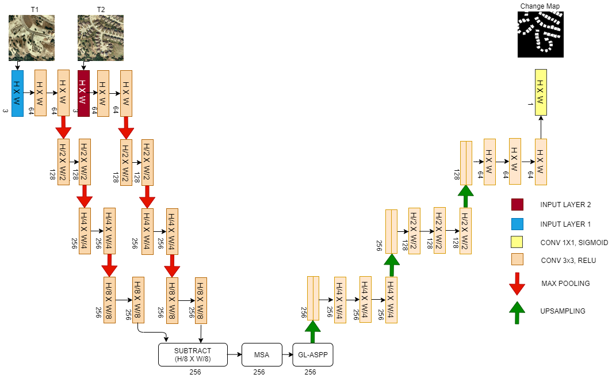
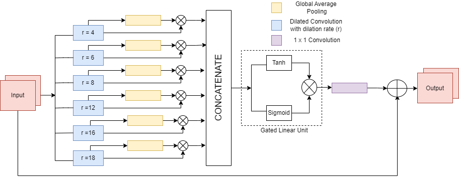
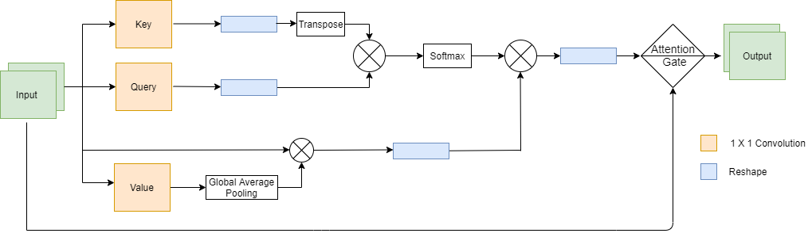
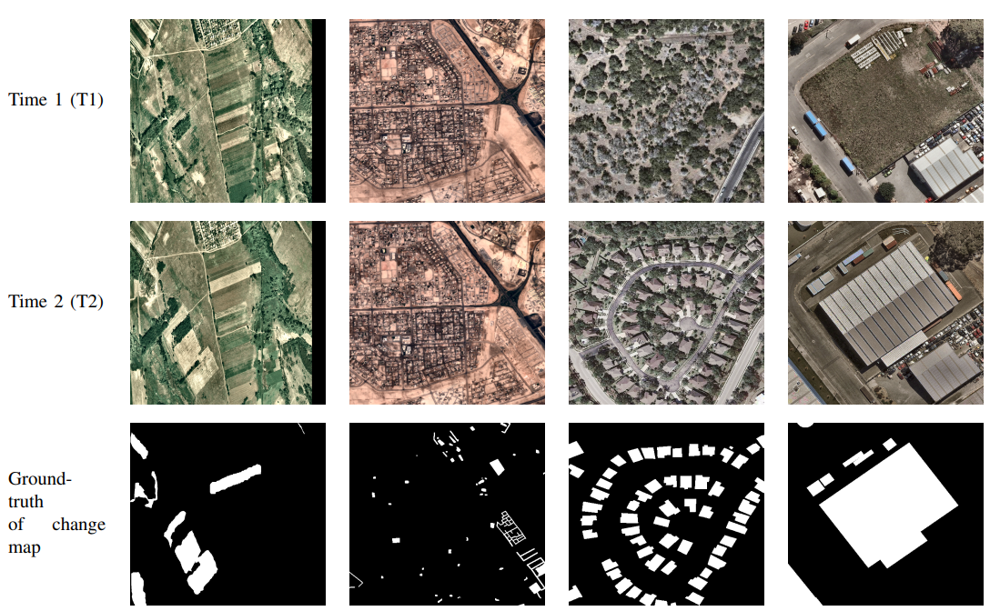
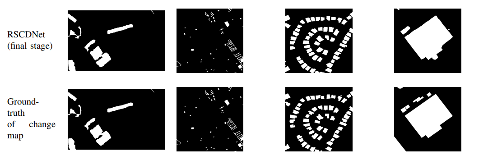

# RSCDNet

Created by <a href="https://www.linkedin.com/in/deepanshi-d/" target="_blank">Deepanshi</a>, <a href="https://www.linkedin.com/in/rahasya/" target="_blank">Rahasya Barkur</a>, <a href="https://www.linkedin.com/in/devishi-suresh/" target="_blank">Devishi Suresh</a> from National Institute of Technology Karnataka, India.

|
|:--:|
| <b> Fig.1 - RSCDNet Architecture</b>|

## Introduction
This work is based on the <a href="" target>paper</a>, which was published in IEEE Transcations on Emerging Topics in Computational Intelligence. We propose a novel architecture, RSCDNet for accurate binary segmentation of change area from bi-temporal images.

Accurate change detection from high-resolution satellite and aerial images is of great significance in remote sensing for precise comprehension of Land cover (LC) variations. The current methods compromise with the spatial context; hence, they fail to detect and delineate small change areas and are unable to capture the difference between features of the bi-temporal images. This paper proposes Remote Sensing Change Detection Network (RSCDNet) - a robust end-to-end deep learning architecture for pixel-wise change detection from bi-temporal high-resolution remote-sensing (HRRS) images. The proposed RSCDNet model is based on an encoder-decoder framework integrated with the Modified Self-Attention (MSA) andthe Gated Linear Atrous Spatial Pyramid Pooling (GL-ASPP) blocks; both  efficient mechanisms to regulate the field-of-view while finding the most suitable trade-off between accurate localization and context assimilation. The paper documents the design and development of the proposed RSCDNet model and compares its qualitative and quantitative results with state-of-the-art HRRS change detection architectures. The above mentioned novelties in the proposed architecture resulted in an F1-score of 98%, 98%, 88%, and 75% on the four publicly available HRRS datasets namely, Staza-Tisadob, Onera, CD-LEVIR, and WHU. In addition to the improvement in the performance metrics, the strategic connections in the proposed <b>GL-ASPP</b> and <b>MSA</b> units significantly reduce the prediction time per image (PTPI) and provide robustness against perturbations. Experimental results yield that the proposed RSCDNet model outperforms the most recent change detection benchmark models on all four HRRS datasets.

<i>Novelties of proposed RSCDNet architecture are as follows:</i>
* The two branches of the encoder unit share weights to derive similar complex traits from the bi-temporal images. The extracted characteristics are then subtracted at the bottleneck for feature comparison. This mechanism also helps the proposed model to be more robust to the synthetic perturbations.
* The proposed model effectively utilizes a Modified Self-Attention (MSA) mechanism at the bottleneck to incorporate the spatial dependencies existing in the obtained features. A gate is integrated into one of the feature spaces in the MSA block to highlight the salient channels. 
* The processed features are subsequently passed through a newly introduced  6-Level Gated Linear Atrous Spatial Pyramid Pooling (GL-ASPP) block to capture a larger field of view. The addition of the gated linear unit after concatenation of the dilated features helps to suppress irrelevant channel information.

|
|:--:|
| <b> Fig.2 - Proposed GL-ASPP block</b>|

|
|:--:|
| <b> Fig.3 - Proposed MSA block</b>|

## Dependencies
    Numpy
    os
    cv2
    sys
    tensorflow
    skimage
    keras

## Usage
To see HELP for the training script:

    python training.py -h

To train the model 

    python training.py --trainPath CD_LEVIR/train --valPath CD_LEVIR/val --imageA_folder img1 --imageB_folder img2 --mask_folder label --batch_size 8 --image_size 1024 --epochs 100 --directory models --modelName rscdnet --len_validation_data 30 --len_train_data 512

To evaluate the model
    python evaluate.py --testPath --imageA_folder --imageB_folder --maks_folder --modelDirectory --modelName

## Results 
|
|:--:|
|<b> Fig.4 - Test images of the datasets Col I: Dataset I (23 years of time difference), Col II: Dataset II (between 2015 and 2018), Col III: Dataset III (between 2002 and 2018), and Col IV: Dataset IV (between 2012 and 2016) </b>|

|
|:--:|
|<b> Fig.5 - edicted change map of proposed RSCDNet on the test images.  Col I: Dataset I, Col II: Dataset II, Col III: Dataset III, Col IV: Dataset IV </b>|

|                           | F1          | Precision | Recall | Kappa | IoU| OA |
| -----------               | ----------- |-----------|--------|-------|----|----|
| Intermediate Stage I      |       0.81 |0.822| 0.889 | 0.843 |0.741| 0.978|
| Intermediate Stage II     | 0.82        |0.742 |0.922 | 0.814 | 0.704 | 0.972|
|Intermediate Stage III     |0.79 |0.813| 0.772 | 0.751 |0.643 | 0.967|
|RSCDNet                    |0.88|  0.872|	0.895|	0.873|	0.781|	0.993|
|Siamese                    |0.63| 0.684	|0.532	|0.567	|0.462	|0.90|
|UNET++                     |0.44|	0.567|	0.362|	0.413|	0.282|	0.941 |
|Triplet loss based model   |0.72|0.867|	0.622|	0.714|	0.571|	0.973 |
|FDCNN                      |0.58|0.522	|0.651	|0.562	|0.413	|0.961 | 
DSMSCN                      |0.85|0.855 |0.852 |0.846 |0.761 |0.945 |
|AGCDetNet                 |0.85| 0.845 | 0.863 | 0.855 | 0.752 | 0.981|

## Citation
If you find our work useful if your research, please consider citing:

